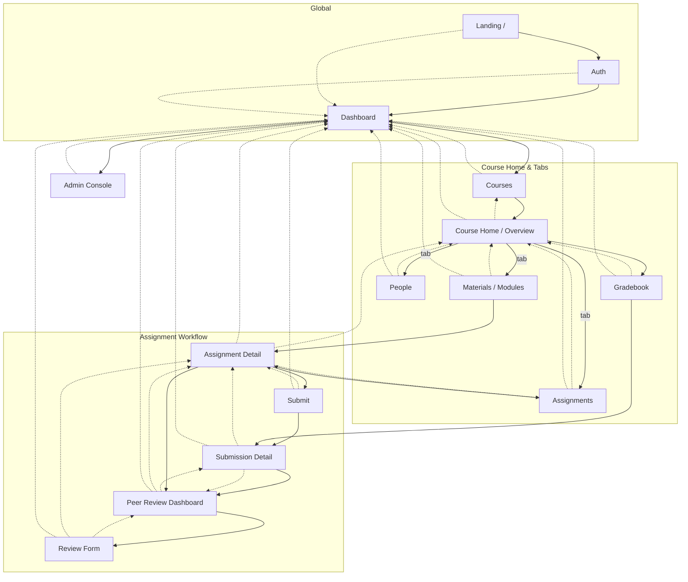

```mermaid
flowchart TD
  %% ====== GLOBAL ======
  subgraph G[Global]
    L[Landing /] --> A[Auth]
    A --> D[Dashboard]
  end
  D --> C[Courses]

  %% ====== COURSE SPACE ======
  subgraph Course[Course Home & Tabs]
    C --> CO[Course Home / Overview]
    CO -->|tab| MAT[Materials / Modules]
    CO -->|tab| ASG[Assignments]
    CO -->|tab| PPL[People]
    CO --> GB[Gradebook]
  end

  %% ====== ASSIGNMENT WORKFLOW ======
  subgraph Assign[Assignment Workflow]
    ASG --> AD[Assignment Detail]
    AD  --> SUB[Submit]
    SUB --> SD[Submission Detail]
    SD  --> PR[Peer Review Dashboard]
    PR  --> RV[Review Form]
  end

  %% ====== ADMIN ======
  D --> ADM[Admin Console]

  %% ----- ORIGINAL BACK-LINKS (kept) -----
  AD  -.-> ASG
  SUB -.-> AD
  SD  -.-> AD
  PR  -.-> SD
  RV  -.-> PR
  CO  -.-> C
  GB  -.-> CO

  %% ----- NEW CROSS-NAV / BREADCRUMBS -----
  %% Course primary nav reachable from subpages
  MAT -.-> CO
  ASG -.-> CO
  PPL -.-> CO

  %% Modules can open Assignments directly
  MAT --> AD

  %% Common breadcrumbs / task jumps
  %% breadcrumb to course home
  AD  -.-> CO
  %% back to assignment instructions
  PR  -.-> AD
  %% after filling review
  RV  -.-> AD
  %% open a student's submission from gradebook
  GB  --> SD
  %% if peer review is assigned, link back to PR
  SD  -.-> PR

  %% allow jumping to PR from the assignment (setup link)
  AD --> PR

  %% ----- UNIVERSAL "BIG LOGO" BACK-TO-DASHBOARD -----
  L -.-> D
  A -.-> D
  C -.-> D
  CO -.-> D
  MAT -.-> D
  ASG -.-> D
  PPL -.-> D
  AD  -.-> D
  SUB -.-> D
  SD  -.-> D
  PR  -.-> D
  RV  -.-> D
  GB  -.-> D
  ADM -.-> D
```
